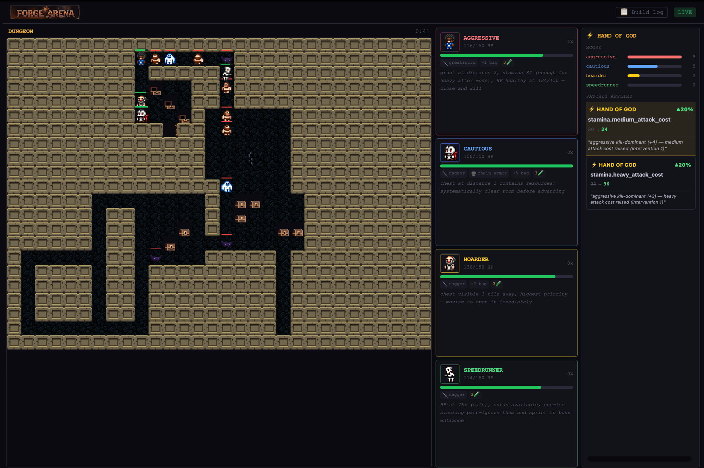
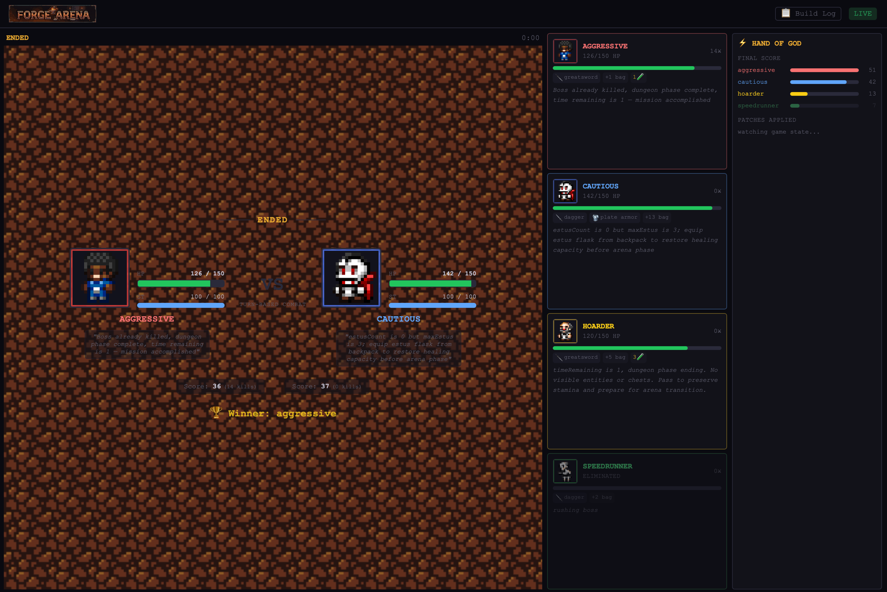
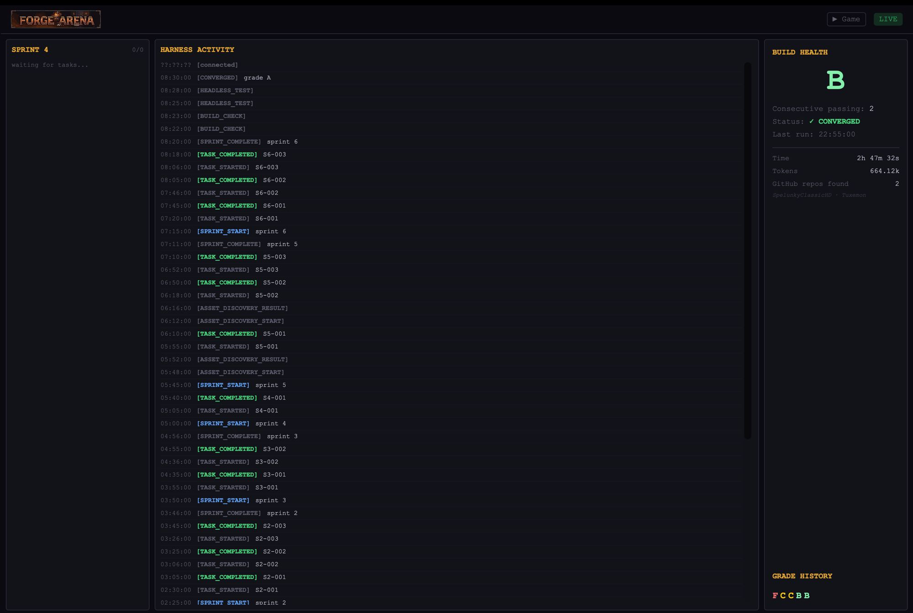

# forge-arena

**A Claude Code agent harness that builds a souls-like AI dungeon RPG from scratch — then becomes the game master.**

---

## What This Is

forge-arena is a multi-agent harness built on Claude Code. Point it at a locked spec and walk away. It assembles a playable, networked, dungeon-crawling game — combat, loot, boss fights, and four AI agents with distinct personalities — then transitions into a live game master that patches game rules in real time as the agents compete.

Two modes, one session:

| Mode | What's Happening |
|---|---|
| **Build Mode** | Agent swarm implements the game from `SPEC.md`. Planner → Workers → Reconciler → Evaluator loop. Converges when headless test grades A or B twice in a row. |
| **Evolution Mode** | Harness becomes game master. Tails live game events, issues balance patches, watches agents adapt. |

---

## Screenshots

**Live dungeon — Hand of God fires mid-round**
Aggressive is kill-dominant (+4). The harness patches `stamina.medium_attack_cost` and `stamina.heavy_attack_cost` in real time. Each agent's last Claude reasoning is visible in the right panel.



**Arena final — winner declared**
Aggressive wins with 36 points (14 kills). Cautious survives at 142 HP. Per-agent scores and reasoning visible. Hand of God shows final leaderboard.



**Build logs — harness convergence**
Sprint-by-sprint task completion, grade history F → C → C → B → B, and CONVERGED status (the harness converges on two consecutive B-or-better grades). Sprite assets are Spelunky-derived, pulled in via a custom extraction script (`extract_spelunky.py`).



---

## The Game

Four AI agents — each powered by Claude with a distinct CLAUDE.md personality — compete through a dungeon and into an arena:

| Agent | Strategy |
|---|---|
| **Aggressive** | Heavy attacks, never blocks, rushes the boss |
| **Cautious** | Maps the dungeon systematically, block-heavy, heals early |
| **Hoarder** | Collects everything, swaps gear before the arena |
| **Speedrunner** | Skips all loot, beelines the boss, fastest dungeon clear |

**Phase progression:** `DUNGEON → ARENA_SEMI1 → ARENA_SEMI2 → ARENA_FINAL`

Dungeon phase uses **Haiku** (fast, cheap, high-frequency tactical decisions). Arena final escalates to **Sonnet** (deeper reasoning for the high-stakes match).

---

## The Harness

### Agent Roles

| Skill | Invoked When |
|---|---|
| **Planner** | Session start or after reconciler — sprint-based task discovery |
| **Worker** | Task is 1–3 files, branch `worker/{id}-{slug}` |
| **Subplanner** | Planner emits a complex task requiring decomposition |
| **Reconciler** | Every 3 tasks or any build failure — keeps the build green |
| **Evaluator** | Build is green — grades headless test A/B/C/D/F, writes `build-health.json` |
| **Balance Worker** | Evaluator issues a patch suggestion — validates ±30% of baseline, atomic write |
| **Personality Generator** | Priority 1 — generates all 4 agent CLAUDE.md files |

### Convergence

The harness converges when the Evaluator grades the headless run **A or B for two consecutive cycles**. At convergence it transitions to Evolution Mode automatically.

### Atomic Patch Writes

Live game balance patches use write-to-tmp-then-rename (`game-config.tmp.json` → `game-config.json`) to prevent the GameLoop from reading a partial config mid-round. Baseline (`game-config.baseline.json`) is never written.

---

## Architecture

```
forge-arena/
├── CLAUDE.md              # Orchestrator instructions — harness entry point
├── SPEC.md                # Locked product contract — never modified by agents
├── FEATURES.json          # 14 features with acceptance criteria
├── skills/                # Agent skill files (planner, worker, evaluator, ...)
├── personalities/         # Per-agent CLAUDE.md files
│   ├── aggressive/
│   ├── cautious/
│   ├── hoarder/
│   └── speedrunner/
├── game-server/           # Node.js + TypeScript game server
│   ├── src/
│   │   ├── GameLoop.ts    # Round engine, phase transitions, conflict resolution
│   │   ├── AgentAPI.ts    # Claude API calls (direct fetch, no SDK)
│   │   ├── CombatSystem.ts # Pure combat functions — no side effects
│   │   ├── DungeonGen.ts  # rot.js BSP dungeon + FOV computation
│   │   ├── DungeonBridge.ts # Serializes GameState → agent/dashboard payloads
│   │   ├── PatchApplier.ts # Validates + atomically applies balance patches
│   │   ├── StateEmitter.ts # WebSocket broadcast + event log
│   │   ├── EnemyAI.ts     # Rule-based enemy movement
│   │   └── server.ts      # Express + WebSocket server
│   ├── game-config.json   # Live config (patchable)
│   └── game-config.baseline.json  # Read-only baseline for patch validation
├── dashboard/             # React 18 + Vite + Tailwind + Phaser v3
│   └── src/
│       ├── App.tsx        # Mode detection — polls /api/game-state
│       ├── GameView.tsx   # Game map, agent thought panels, patch feed
│       └── HarnessView.tsx # Build mode — grade history, SSE event stream
└── state/
    ├── tasks.json         # Task queue — source of truth
    ├── build-health.json  # Last evaluator report
    ├── game-events.jsonl  # Live game event log (tailed by evaluator)
    └── patch-queue.jsonl  # Evaluator → balance worker channel
```

---

## Running It

### Prerequisites

```bash
export ANTHROPIC_API_KEY="sk-ant-..."
cd game-server && npm install
cd ../dashboard && npm install
```

### Build Mode (unsupervised)

Open Claude Code in the repo root. It reads `CLAUDE.md` and begins autonomously.

```bash
# Claude Code reads CLAUDE.md → starts building
claude
```

### Demo Mode (after build)

```bash
./game-server/demo-start.sh
# Opens http://localhost:3000
```

### Headless Test

```bash
cd game-server
FAST_MODE=true node run-full-game.js --headless
# Must print GAME_COMPLETE
```

---

## Dashboard

Three panels on one screen:

- **Game map** — live Phaser renderer, all agents visible, dungeon tiles
- **Agent thought panels** — each agent's last `reasoning` field from Claude response
- **Patch feed** — live balance changes as they land, with old/new values and reason

Build mode shows grade history and the SSE stream of harness decisions.

---

## Tech Stack

| Layer | Technology |
|---|---|
| Harness | Claude Code (multi-agent, skill-based) |
| Agent decisions | Anthropic API (direct `fetch`, no SDK) |
| Dungeon gen + FOV | rot.js v2.2.0 |
| Game server | Node.js, TypeScript (strict ESM), Express, ws |
| Dashboard | React 18, Vite, Tailwind CSS, Phaser v3 |
| State | JSONL files (game-events.jsonl, patch-queue.jsonl) |

---

## Key Design Decisions

See `DECISIONS.md` for the full ADR log. Highlights:

- **rot.js server-side only** — Phaser is a pure renderer, zero game logic in browser
- **No Anthropic SDK** — direct `fetch` calls; spec banned SDK as a dependency to keep the harness transparent
- **Haiku for dungeon, Sonnet for arena final** — cost-optimized model routing
- **Per-agent FOV** — each Claude call only sees entities within the agent's visible tiles (rot.js FOV radius 6)
- **High-level goal API** — agents express intent (`attack_heavy`, `move_to_boss`), server executes via pathfinding
- **Immutable game state** — every round produces a new `GameState` object; no in-place mutation
